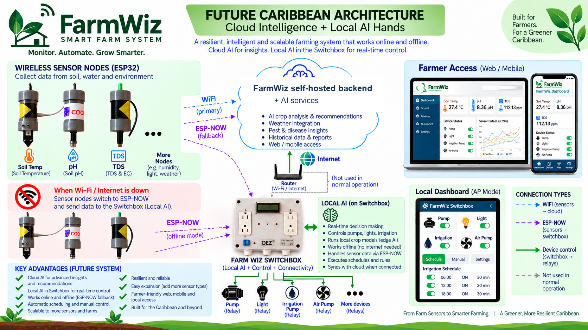

# FarmWiz Architecture



## Phase 1 — Existing foundation

```text
Farm sensor nodes ──Wi-Fi──> ThingsBoard ──> Monitoring / history

FarmWiz Switchbox ──> Local scheduling / control ──> Relays ──> Equipment

Where supported:
Sensor node ──ESP-NOW──> Switchbox / local hub
```

Sensor nodes normally send telemetry directly to ThingsBoard over Wi-Fi. The Switchbox is used for local scheduling and equipment control during normal operation, and can provide additional local connectivity/hub responsibilities during connectivity loss where implemented.

## Phase 2 — Future Caribbean AI layer

```text
Farmer ↔ FarmWiz dashboard ↔ FarmWiz Cloud AI
                                  ├─ ThingsBoard read-only telemetry/history
                                  ├─ Open-Meteo weather
                                  ├─ geocoded location
                                  └─ crop profiles / farmer input
                                           ↓
                               deterministic findings + AI reasoning
                                           ↓
                                  recommendations / action drafts
                                           ↓
                                      mock edge only
```

The submitted application is isolated from the operational FarmWiz stack. Its tested action lifecycle ends at a mock edge. The source contains narrow, separately guarded ThingsBoard test/alarm methods, but no public claim of live autonomous physical control is made here.
