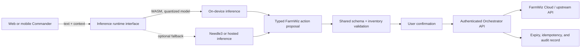

# Future direction: WASM inference on web and mobile

The longer-term direction is to move suitable model inference onto the user's phone or browser through WebAssembly, while retaining a compatible path for a server-hosted model. This is a future development goal, not a capability in the current release.

## Proposed evolution

## Development path

1. **Stabilize contracts first.** Version the action proposal, capability-manifest, and registry schemas. Keep inference output as a typed proposal; all runtimes must use the same deterministic validation and safety rules.
2. **Introduce an inference interface.** Separate prompt/context preparation and model invocation from the Orchestrator's HTTP routes. Keep the current Needle3 integration behind an implementation of that interface.
3. **Benchmark model candidates.** Measure download size, memory, startup time, latency, battery use, and tool-selection accuracy on representative phones and browsers. Prefer quantized models that fit practical mobile limits.
4. **Build a WASM proof of concept.** Package inference as a versioned worker/module, keep large model weights separately cacheable, and define supported browser/mobile CPU and SIMD requirements. Consider WebGPU as an optional acceleration path, with WASM as the portable baseline.
5. **Preserve safety and privacy.** Run schema validation and inventory grounding locally, ask for confirmation on state changes, and avoid sending device credentials or unnecessary telemetry to the model. Treat browser storage as untrusted; never store long-lived secrets there.
6. **Add authenticated remote execution separately.** A mobile client outside the LAN needs user/device authentication, authorization, TLS, request expiry, replay protection, and auditable upstream routing before it can call the gateway. Local model inference does not itself authorize a device action.
7. **Roll out incrementally.** Start with read-only/local simulations, compare WASM and Needle3 proposals, then evaluate approved actions using mocks. Preserve a server fallback and a rollback switch until device-class coverage is established.

## Design constraints

- The WASM runtime proposes actions; it never gets direct MQTT, GPIO, or arbitrary network access.
- A versioned, deterministic validator remains the authority for tool names, device IDs, capabilities, arguments, confirmation, expiry, and limits.
- The Orchestrator continues to own credentials, upstream API calls, and audit records. Inference portability must not require shipping reusable cloud credentials to a client.
- Model and tokenizer versions are pinned and integrity-checked. Updating model assets is a separate release from changing device contracts.
- Offline inference can improve availability and privacy, but execution still depends on an authenticated route to the target service.
