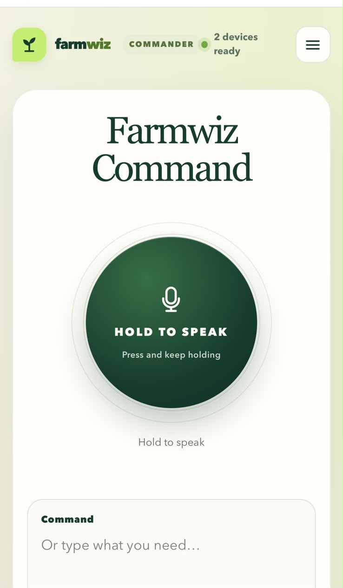

# FarmWiz Orchestrator

Node.js service and browser Commander for the FarmWiz local control plane. The Pi hosts the web/API service, registry, and outbound integrations. The browser UI is served by the same service.

## Release contents

- `orchestrator.mjs` and its local modules: HTTP/HTTPS API, registry, device-definition import, MQTT inventory, and FarmWiz Cloud profile support.
- `ui/index.html`: Farmwiz Command interface.
- `needle-tools.json`: base tool catalog and candidate-generation input.
- `farmwiz-orchestrator.service`: systemd service unit.
- `orchestrator.env.example`: non-secret runtime configuration template.
- `INSTALLATION.md`: Raspberry Pi setup and TLS instructions.
- `FUTURE-WASM-ROADMAP.md`: direction for browser/mobile model inference.

## Important runtime boundary

Needle3 is an external service at `NEEDLE_URL` (default `http://127.0.0.1:7101`). Its executable and model are not included. The current Orchestrator safely prepares and validates requests, but a physical device command adapter is not enabled; state-changing actions are not executed. See the project integration report for the verified scope and limitations.

## Development

Requires Node.js 22.x. Run `npm ci` to install the locked dependencies, then `node --check` on changed modules. There is no compile/bundle step: the server and browser UI run from source. Do not commit runtime credentials, TLS private keys, local registry data, or generated catalogs.

See [INSTALLATION.md](INSTALLATION.md) and [FUTURE-WASM-ROADMAP.md](FUTURE-WASM-ROADMAP.md).
