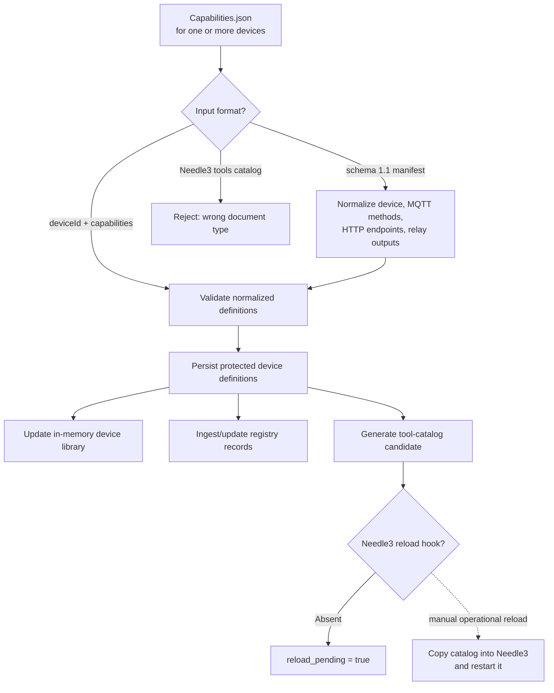
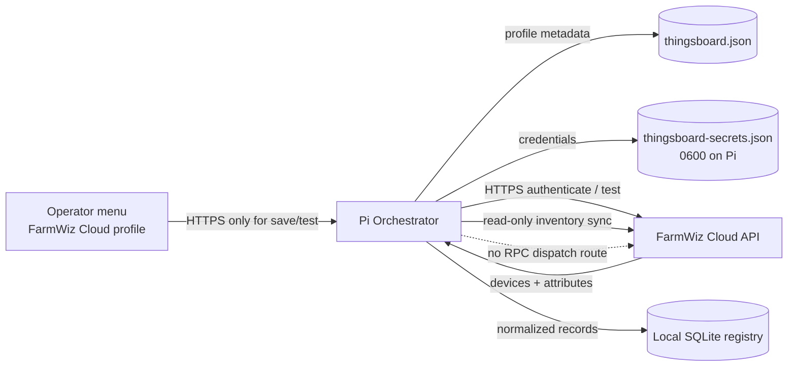

# FarmWiz Integration and Tool-Calling Technical Report

**Subproject:** FarmWiz Orchestrator integration and tool-calling  
**Runtime reviewed:** Raspberry Pi Orchestrator at `192.168.100.82:7100`, local Needle3 service at `127.0.0.1:7101`  
**Report date:** 2026-09-26  
**Status:** Integration foundation deployed; device RPC execution is not implemented

## 1. Executive summary

FarmWiz Orchestrator is a local control-plane service. It presents a browser UI, sends natural-language requests to Needle3, checks the returned structured calls against a fixed tool policy and the current registry, and returns a proposed action to the browser.

The current runtime deliberately stops before device actuation. A valid state-changing proposal is returned as `confirmation_required`, with `adapter: not-configured` and `effects_executed: false`. There is no confirmation endpoint that turns the proposal into a device command. MQTT support currently discovers inventory only; it is not a command transport.

Two ControlHub definitions, `ControlHub_01` and `ControlHub_02`, are registered. Their normalized definitions include a semantic light override: invoke `setLight` on the selected device with JSON Boolean `value` (`true` on, `false` off); firmware selects the relay. This override is stored with the device capabilities, but the current intent matcher and execution path do not consume it. In particular, the existing `set_relay` matching logic recognizes an HTTP toggle or MQTT `setRelay`; neither is an implementation of the `setLight` semantic operation.

The FarmWiz Cloud profile scaffolding stores a server URL, auth mode, protected credential, and FarmWiz-ID-to-cloud-device-UUID bindings. Its connection check and inventory sync are separate from the command path. No command RPC endpoint, remote mobile/web user authentication, or public ingress is deployed.

## 2. Current deployed architecture

```mermaid
flowchart LR
  U[Browser user\nFarmwiz Command UI] -->|POST /v1/interpret\n{text}| O[FarmWiz Orchestrator\nPi :7100]
  O -->|POST /complete\nrequest text| N[Needle3\n127.0.0.1:7101]
  N -->|structured function calls\nconfidence / grounding| O
  O --> V[Tool policy +\nregistry validation]
  V -->|read_only_ready| R[Proposal response]
  V -->|confirmation_required\nadapter: not-configured| R
  V -->|blocked / needs_clarification| R
  R --> U
  D[(SQLite device registry)] --- V
  F[(Protected device definitions\n/etc/farmwiz-orchestrator/devices.json)] --- V
  G[(Generated Needle3 catalog\nneedle-tools.generated.json)] -. candidate only .-> N
  V -. no executor is wired .-> X[Device command endpoint\nnot implemented]
```

The Orchestrator service is LAN-bound. Needle3 is a separate local process and receives text for interpretation; it is not granted GPIO, shell, or direct device-control authority. The Orchestrator is the policy boundary that decides whether a returned call is known, complete, grounded, allowed by the registry, and supported by a declared device capability.

### Main request path

1. The UI posts the user's text to `POST /v1/interpret`.
2. The Orchestrator calls Needle3's `/complete` endpoint with that text.
3. Needle3 returns a structured call result. The Orchestrator rejects absent calls, ungrounded arguments, unknown tool names, missing required arguments, invalid relay numbers, invalid states, unsafe durations, and targets/capabilities absent from the current registry.
4. The Orchestrator attaches device-tool matches and returns a proposal. For a state-changing operation, the status is `confirmation_required`; for a read-only operation it is `read_only_ready`.
5. The UI renders the proposal and status. No call is dispatched to a ControlHub.

The UI submits on Enter; Shift+Enter inserts a newline. This is a request submission affordance, not an action-approval gate.

## 3. Tool definition, matching, and validation

The base catalog at `orchestrator/03_pi-implementation/needle-tools.json` supplies Needle3 with JSON-schema-like descriptions for normalized FarmWiz tools such as `get_hub_status`, `set_relay`, and `set_schedule`. On startup and after a device import/edit/delete/reset, the Orchestrator regenerates a device-aware catalog candidate. The candidate narrows device IDs and relay values to the declared inventory.

Device capability definitions use stable device identifiers plus capability metadata. Accepted inputs include schema 1.1 `device-capabilities` manifests and normalized `deviceId`/`capabilities` definitions. The importer normalizes a capability manifest into the definition model, persists it on the Pi, updates the in-memory device library, ingests corresponding registry entries, and produces a catalog candidate. Sensitive broker credentials are not copied from a capability manifest into runtime configuration.



The registry represents known devices and capabilities. The device definition file is the source for normalized tool matching. They serve different roles: registry membership alone does not provide an executable transport or parameter mapping.

### Match status is not executability

`matchDefinedDeviceTools()` compares normalized tool intents to declared device operations. For example, `set_relay` can match the device's `toggle_relay` HTTP endpoint or `setRelay` MQTT method. These are marked `matched_needs_review` when the Orchestrator lacks safe translation (toggle is non-idempotent; MQTT argument mapping is undefined). Matches carry `executable: false`.

The current `INTENT_TOOLS` map does not map a light-specific call to `setLight`. It does not read `capabilities.semanticOperations.lights`. Therefore, the stored light override is currently documentation/configuration data for a future adapter, rather than a live tool-call mapping. Do not infer successful RPC execution from the presence of that override or from Needle3 recognizing a light request.

## 4. Two ControlHub instances and light semantics

`docs/devices-two-instances.json` contains the normalized import definitions for both hubs. `docs/device-instance-overrides.json` is the shared override source used to derive the per-instance data. Each instance has its own `deviceId`, display name, and aliases while sharing the ControlHub type/capabilities.

The light semantic definition is:

| Field | Value |
|---|---|
| Intent | `control_lights` |
| RPC method | `setLight` |
| Target scope | Device |
| Relay selection | Firmware-internal |
| Parameter | `value` |
| Encoding | JSON Boolean |
| ON / OFF | `true` / `false` |

The intended mapping makes the selected device instance—not a separately chosen relay number—the target. It avoids translating an idempotent set-state request into a relay toggle. This definition is not yet connected to the current generic `set_relay` schema, which uses a relay number and string state (`on` / `off`). It should become its own typed operation (for example, a device-targeted `set_light` with Boolean `value`) or an explicitly validated semantic operation. Do not silently coerce the Boolean to integer `1`/`0`.

```mermaid
sequenceDiagram
  actor User
  participant UI as Farmwiz Command UI
  participant O as Orchestrator
  participant N as Needle3
  participant D as Device definitions + registry
  participant C as FarmWiz Cloud API
  participant H as ControlHub firmware

  User->>UI: "Turn the lights on at ControlHub_02"
  UI->>O: POST /v1/interpret {text}
  O->>N: POST /complete {input}
  N-->>O: proposed tool call
  O->>D: validate exact device, operation, Boolean value
  D-->>O: device and capability match
  O-->>UI: current behavior: proposal only\nconfirmation_required; no adapter
  Note over O,H: No RPC is sent in the deployed version
  Note over C,H: FarmWiz Cloud / RPC command path is future work
```

## 5. FarmWiz Cloud integration

The Pi is intended to behave as a remote client: a future external mobile/web app would send authenticated commands to a public-facing application/API, and the Pi-side Orchestrator would call the upstream FarmWiz Cloud service over HTTPS. The present setup menu is an operator profile interface, not that remote app API.

The deployed profile foundation includes:

- HTTPS base URL and profile name.
- JWT-style username/password or API-key authentication mode.
- Protected credential storage on the Pi, separate from non-secret profile configuration (files under `/etc/farmwiz-orchestrator/`, written with restrictive permissions).
- Editable mapping from FarmWiz device ID to cloud device UUID.
- A connection/authentication check.
- A read-only inventory synchronization route that obtains device information and selected attributes, then ingests normalized records into the local registry.

Saving credentials and testing the profile require a secure HTTPS dashboard request. The LAN dashboard is HTTP, so the profile form cannot save or test credentials through its current plain-HTTP URL. No credential or UUID binding was saved in the current deployment.



The internal API paths and implementation filenames still use the historical `thingsboard` identifier. The dashboard presents the product-facing name **FarmWiz Cloud**. The upstream cloud server implementation, its API details, and its credentials are external dependencies; this report does not assert that the cloud has accepted a device RPC command.

### Two distinct MQTT responsibilities

The Orchestrator's MQTT component is an optional inventory discovery client. When explicitly requested and enabled, it connects to the configured broker, publishes `ping *` on the discovery request topic, listens on the response topic, parses returned inventory, and ingests devices into the registry. It does not publish tool calls to each hub's RPC topic. A capability manifest's `mqttRpcTopic` and method list are metadata only until a command adapter implements per-device addressing, authentication, payload shape, response correlation, timeout, and error handling.

## 6. Current safety and operational status

| Area | Deployed state |
|---|---|
| Orchestrator | Active on the Pi, LAN-bound at `192.168.100.82:7100` |
| Needle3 | Local service at `127.0.0.1:7101`; receives text for structured interpretation |
| Device inventory | 2 registry records and 2 defined devices (`ControlHub_01`, `ControlHub_02`) |
| Device-aware catalog | Candidate generated; deployment status reports `reload_pending: true` |
| Tool calls | Validated and returned as proposals; no command adapter is configured |
| Physical effects | `effects_executed: false`; no device command sent in this increment |
| MQTT | Inventory discovery capability exists; current health reported disconnected; not a tool command path |
| Cloud profile | UI and protected config/auth-check support exist; no credential or UUID mapping configured |
| Remote app authentication | Not implemented |
| Cloud RPC / device control | Not implemented |
| Public ingress | Not implemented; no inbound route is configured |

The health endpoint's `effects_executed: false` field describes the Orchestrator's current behavior. A `confirmation_required` status is not a pending executable job: there is no confirmation/dispatch endpoint behind it.

## 7. Recommended next implementation increment

```mermaid
flowchart TD
  A[External mobile/web user] --> B[Authenticated public app/API\nidentity + authorization]
  B -->|outbound-safe command request\nrequest ID + expiry| C[Pi Orchestrator ingress\nHTTPS, device/user authorization]
  C --> D[Parse typed operation]
  D --> E[Resolve FarmWiz device ID\nto cloud device UUID]
  E --> F[Validate capability + semantic override]
  F --> G[Confirmation / policy gate\nwhen required]
  G --> H[Cloud RPC adapter]
  H -->|HTTPS RPC request\nsetLight(value: true/false)| I[FarmWiz Cloud]
  I --> J[ControlHub_01 or ControlHub_02]
  J --> K[Device result / state]
  K -->|correlated result| H
  H --> L[Audit event + bounded response]
  L --> B
  F -. reject unknown target, method,\nargument, expired request .-> M[Safe refusal]
```

Before implementing that path, freeze the following contracts:

1. **External identity and authorization:** identify users/devices, authorize each FarmWiz ID, define revocation, and avoid exposing reusable cloud credentials to browsers.
2. **Ingress and networking:** define an authenticated HTTPS route for the external app. Preserve outbound-only device/cloud behavior where possible; do not add LAN port forwarding as a shortcut.
3. **Typed operation contract:** define `set_light(device_id, value: boolean)` and any other semantic operations independently of firmware method names. Validate exact device binding and capability.
4. **Cloud API mapping:** verify the target cloud RPC endpoint, request shape, authentication headers, timeout, idempotency behavior, accepted Boolean representation, and response/result semantics against the supplied API documentation and a non-actuating fixture.
5. **Confirmation and replay policy:** define which operations require explicit confirmation, request expiry, deduplication/idempotency keys, and safe behavior on retries or lost responses.
6. **Adapter and audit:** implement a narrow cloud adapter; record requester, operation, target, normalized arguments, outcome, correlation ID, and timestamp without logging secrets.
7. **Verification:** use mocked API tests first, then a read-only cloud check, then obtain explicit approval for the smallest physical-control test. Verify resulting state independently at the hub.

Do not use the existing `toggle_relay` endpoint as a retryable substitute for set-state: toggling is not idempotent. Do not consider generic MQTT inventory discovery to be an RPC transport.

## 8. Relevant files and endpoints

| Component | Workspace file or endpoint | Role |
|---|---|---|
| HTTP service and policy | `orchestrator/03_pi-implementation/orchestrator.mjs` | `/v1/interpret`, registry/config routes, Needle3 request, validation and proposal response |
| Device definition validation/matching | `orchestrator/03_pi-implementation/device-tools.mjs` | Manifest normalization, capabilities, intent-to-device-operation matching |
| Catalog builder | `orchestrator/03_pi-implementation/needle-tools-catalog.mjs` | Generates and validates device-aware Needle3 catalog candidates |
| Base function tools | `orchestrator/03_pi-implementation/needle-tools.json` | Descriptions and argument schemas for Needle3 function calling |
| Cloud inventory/profile adapter | `orchestrator/03_pi-implementation/thingsboard.mjs` and Orchestrator profile routes | Cloud authentication and read-only inventory sync; no RPC call route |
| MQTT inventory discovery | `orchestrator/03_pi-implementation/mqtt-inventory.mjs` | `ping *` discovery request/response; no tool command dispatch |
| Two-instance import | `docs/devices-two-instances.json` | Normalized ControlHub_01 and ControlHub_02 definitions plus overrides |
| Shared semantic override | `docs/device-instance-overrides.json` | `setLight` Boolean intent and instance labels/aliases |
| API validation route | `POST /v1/interpret` | Accepts `{ "text": "..." }`; returns status/proposals, no execution |
| Device import route | `POST /v1/registry/import-devices` | Validates and stores device definitions, registry records, catalog candidate |
| Health route | `GET /health` | Service, inventory, generated catalog, MQTT and effects status |
| Cloud profile routes | `/v1/config/thingsboard` and `/v1/config/thingsboard/test` | Profile save/read and auth check; internal path naming retained |

## 9. Source and evidence notes

This report is based on the workspace implementation, system-contract documents, device definition/override files, and the implementation/deployment/integration-verification records. The last recorded live deployment check reports an active service, two registered devices, two definitions, a LAN bind, a generated catalog awaiting Needle3 reload, and `effects_executed: false`.

The workspace verification report is marked partial-safe and explicitly records that no ControlHub was contacted and no relay, schedule, sensor, MQTT, HTTP, or cloud command was executed in that verification run. Later deployments and imports are described in the implementation/deployment logs; those records do not establish that RPC execution works.
