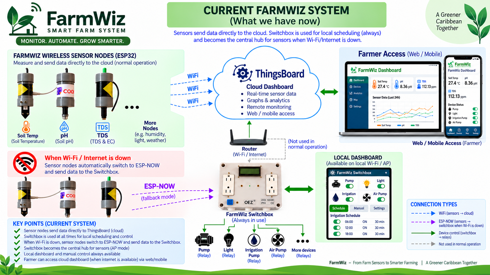

# Phase 1 — Existing IoT Foundation

Before Future Caribbean, FarmWiz existed as an IoT monitoring and automation platform. Its documented foundation includes ESP32 sensor nodes, environmental and water-quality sensing, ThingsBoard telemetry and dashboards, and a FarmWiz Switchbox for local scheduling and relay-based equipment control.

Under normal connectivity, sensor nodes send telemetry directly to ThingsBoard over Wi-Fi. The Switchbox is also used during normal operation for local scheduling and equipment control. Where supported, sensor nodes can fall back to ESP-NOW and communicate with the Switchbox/local system when Wi-Fi or Internet connectivity is unavailable.

This directory contains the current FarmWiz system architecture overview and is also the location for the historical Phase 1 firmware and infrastructure source as it is organized.

Additional historical Phase 1 source code may be added to this directory later. The Future Caribbean 2026 submission primarily focuses on the Cloud AI and Edge AI layers built on top of this existing FarmWiz IoT foundation.
